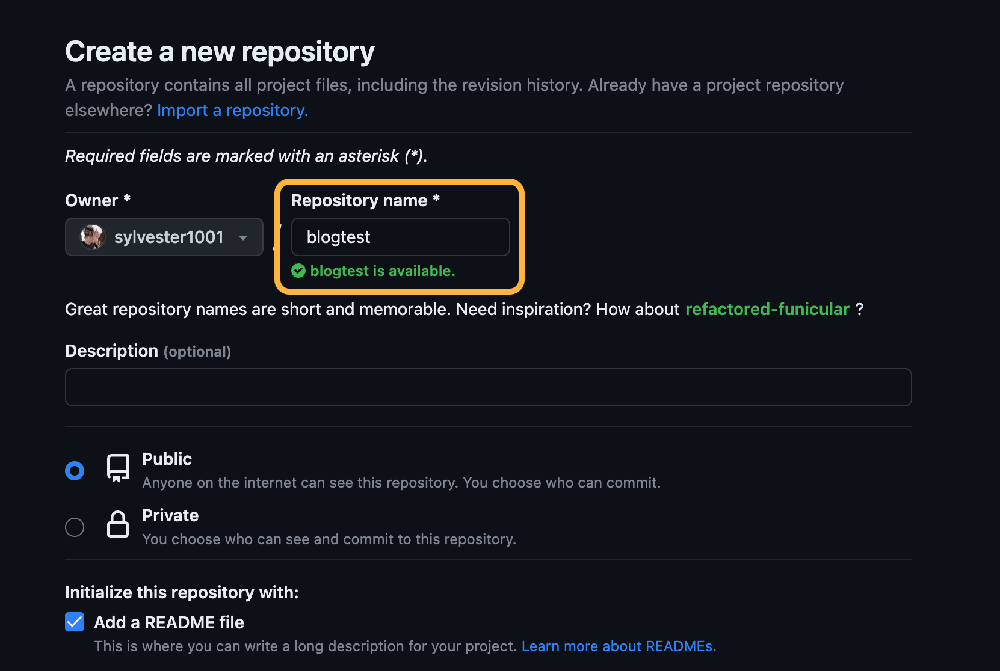
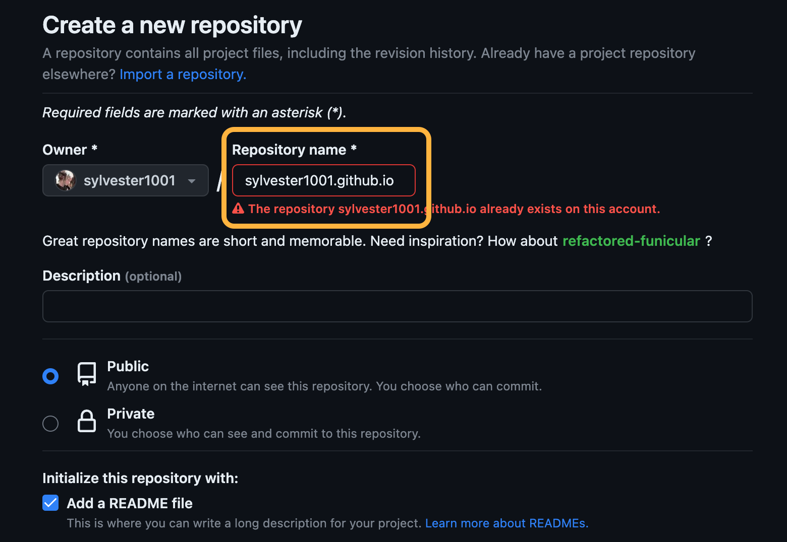
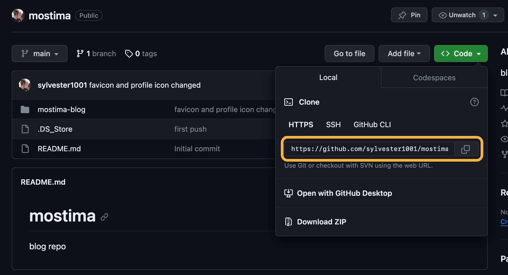
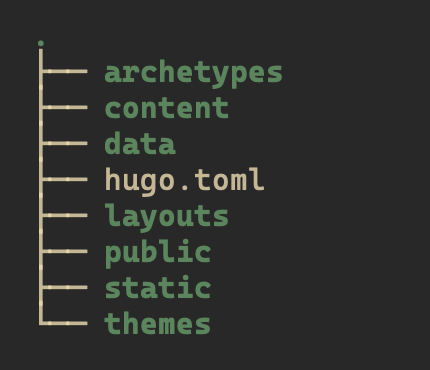

## 简介

在博客搭建完成之后，我意识到，建站对我来说是一个极低频的工作，除非以后需要更换新的部署方案，否则只有极小的可能性对网站进行大的变动，为了避免我忘记，也为了给有需要的人提供一些力所能及的帮助，故尽量详细的写下此文，如果有错误或误导的内容，请不吝在文末留言，或者邮件联系我～那么就开始吧


## Hugo

Hugo 是一个用 Go 实现的静态网站生成器，采用 Markdown 进行文章编辑， 并将 Markdown 文件转化成 HTML 文件来构建网页。支持丰富的主题配置，且可以通过 js 嵌入评论系统等插件。

## GitHub Pages

GitHub Pages 是一个静态网站托管系统，它直接从 GitHub  上的仓库获取 HTML, CSS 和 JavaScript 文件，通过构建过程运行文件，然后发布网站。 


---

## 搭建需求

1. 1个 GitHub 账号

2. 2个 GitHub 仓库

   - **博客内容仓库**: 存储博客的内容文件(文档, 图片等)

     - 输入你想要的仓库名
     - 选择 Public
     - 选择 Add a README file

   - **GitHub Pages 仓库**: 通过GitHub Pages来搭建博客, 自然需要一个GitHub Pages 仓库

     - 此仓库需要以你的 `用户名.github.io` 的形式来命名
     
     - 选择 Public
     
     - 选择 Add a README file
     
       
     
       >由于我已经创建过这个仓库，所以会红字报错，如果你是新建的话不会有此错误
     
       

---

## 安装Hugo

### 前置需求

- git
- go
- dart sass

在确保以上需求满足的情况下, 开始安装Hugo

### 安装方法

安装方式可选择

- 包管理器安装

  

  较为方便, 但较保守系统如 Debian 可能安装的版本会较低

  

- 二进制文件安装

- 源码编译安装

#### 包管理器安装

##### macOS

```bash
brew install hugo
```

##### Arch Linux

```bash
sudo pacman -S hugo
```

##### Debian & Ubuntu

```bash
sudo apt install hugo
```

##### Fedora

```bash
sudo dnf install hugo
```

##### openSUSE

```bash
sudo zypper install hugo
```

#### 二进制文件安装

1. 下载适合你系统版本的 [Hugo二进制文件](https://github.com/gohugoio/hugo/releases/latest)
2. 将文件解压
3. 将执行文件添加进 `PATH` 中

#### 源码编译安装

要使用源码编译方式安装, 需要满足以下条件:

1. 已安装 Git

2. 已安装 Go 1.19 或更高版本

3. 已安装一个C解析器, GCC 或 Clang

   > 安装目录由 GOPATH 和 GOBIN 环境变量控制。如果设置了 GOBIN，二进制文件将安装到该目录。如果设置了 GOPATH，二进制文件将安装到 GOPATH 列表中第一个目录的 bin 子目录。否则，二进制文件将安装到默认 GOPATH（$HOME/go 或 %USERPROFILE%\go）的 bin 子目录下。

4. 编译安装

   ```bash
   CGO_ENABLED=1 go install -tags extended github.com/gohugoio/hugo@latest
   ```

#### 安装结果测试

```bash
hugo version

# 如果返回以下类似内容, 则表示安装成功
hugo v0.119.0+extended linux/amd64 BuildDate=unknown
```


---


## 克隆blog仓库到本地

1. 进入你想要储存项目的目录中，例如 `blog`

   ```bash
   cd blog
   ```

2. 将之前创建好的「**博客内容仓库**」克隆到当前目录中

   ```bash
   git clone https://github.com/你的github用户名/仓库名.git
   ```

   也可以在这里找到你的仓库链接

   

---

## 使用 Hugo 创建站点

1. 进入克隆下来的「**博客内容仓库**」中

   ```bash
   cd <博客内容仓库名>	
   ```

2. 创建站点，名字由你选择

   ```bash
   hugo new site <your site name> 
   ```
   
   创建好之后目录的包含如下文件夹及文件
   
   
   
   

---

## Hugo 主题的安装与配置

Hugo社区中提供各种主题, 挑选自己喜欢的即可, 各种主题都有详细的文档告诉你如何安装.

我使用了 Blowfish, 所以接下来的内容都已 Blowfish 为例.

### 安装 Blowfish 主题

有两种方式, 分别为

- 使用 git 安装
- 使用 Hugo 安装

#### 使用 git 安装

1. 进入你的 blog 仓库

   ```bash
   cd <博客内容仓库名>	
   ```

2. 初始化 git, 并下载 Blowfish 主题

   ```bash
   git init
   git submodule add -b main https://github.com/nunocoracao/blowfish.git themes/blowfish
   ```

#### 使用 Hugo 安装


**注意** 要使用此方法, 请确保你使用的是 **Go 1.12** 或更高版本


1. 进入你的 blog 目录

   ```bash
   # 如果你在GitHub上管理你的项目
   hugo mod init github.com/<用户名>/<仓库名>
   
   # 如果在本地管理项目
   hugo mod init my-project
   ```

2. 创建一个新文件 `config/_default/module.toml`，并添加以下内容，将主题添加到配置中：

   ```toml
   [[imports]]
   path = "github.com/nunocoracao/blowfish/v2"
   ```

3. 使用 `hugo server` 启动服务, 主题将会自动下载


### 配置 Blowfish 主题

由于我选用了 Blowfish , 所以这里以 Blowfish 为例.

#### 从主题目录中复制配置文件

1. 进入站点根目录中 (即刚才使用 `hugo new site yoursite ` 创建的目录 ), 删除 `config.toml` 文件删除, 如果不存在这个文件, 则忽略这一步

2. 将主题文件夹中的所有后缀为 `.toml` 的文件都复制到 `yoursite/config/_default/` 目录下. 

   
   **注意**: 如果你的 `config/_default/` 目录下已存在 `module.toml` 文件, 请勿将其覆盖
   

   主题文件夹中的配置文件一般位于: `yoursite/themes/blowfish/config/_default` 中

3. 完成复制后, 你的 `config/_default` 目录应该包含以下文件

   ```bash
   config/_default
       ├── config.toml
       ├── languages.en.toml.bak
       ├── languages.zh-cn.toml
       ├── markup.toml
       ├── menus.zh-cn.toml
       ├── module.toml
       └── params.toml
   ```

#### 基础配置

##### 修改 `config.toml`

1. **theme**

   ```toml
   # 将 theme 修改为你的主题名, 表示你将要使用的主题
   theme = "你的主题名"
   ```

2. **baseURL**

   ```toml
   # 将baseURL 修改为你的域名
   baseURL = "https://yourdomain.com/"
   ```

   

   **注意**：若你尚未在 Github Pages 中设置自定义域名, 请填入 `https://<username>.github.io/`

   

3. **defaultContentLanguage**

   ```toml
   # 默认的 defaultContentLanguage 为 英语
   defaultContentLanguage = "en"
   
   # 如果你的博客主要语言是中文的话, 需要将其设置为
   defaultContentLanguage = "zh-cn"
   ```

##### 修改 `languages.en.toml`

1. **修改文件名**

   如果在上一步 `config.toml` 文件中 `defaultContentLanguage` 项设置为 `zh-cn` 的话, 需要将文件`languages.en.toml` 的文件名修改为`languages.zh-cn.toml`

2. **修改文件内容**

   ```toml
   # 将 languages.zh-cn.toml 文件中的下列项修改为以下内容
   languageCode = "zh-cn"
   languageName = "简体中文"
   
   [params]
     displayName = "ZH-CN"
     isoCode = "zh-cn"
   ```

   

#### *可选配置

以下内容不做特别声明, 都在`config/_default/params.toml` 文件中配置.

##### Header

定义整个网站的 header 风格, 可以选择的参数有 `basic`, `fixed`, `fixed-fill`, `fixed-fill-blur`

我使用的是 `fixed-fill-blur`

```toml
[header]
  layout = "fixed-fill-blur"
```

##### Homepage

1. 主页的风格

   可选参数有 `page`, `profile`, `hero`, `card`, `background`, or `custom`.

   ```toml
   [homepage]
     layout = "background"
   ```

2. Recent

   在首页显示最近添加的博文

   ```toml
   [homepage]
     showRecent = true
   ```

3. cardview

   将 Recent 的内容以卡片样式展示

   ```toml
   [homepage]
     cardView = true
   ```

##### Article

1. **Likes & Views**

   在文章界面展示点赞量和阅读量

   ```toml
   [article]
     showViews = true
     showLikes = true
   ```

   
   **注意**: 这只是打开了允许显示的开关, 但要使网站获取 Likes 和 Views 的数据, 还需要配置 [firebase](#firebase), 请在后面浏览相关条目
   

2. **Author**

   在博文界面展示作者信息

   ```toml
   [article]
     showAuthor = true
   ```

3. **Table Of Contents**

   在博文界面显示目录

   ```toml
   [article]
     showTableOfContents = true
   ```

   

   **注意**: 要在移动端正确显示还需要以下步骤

   

   1. 在博客目录下的 `i18n` 目录中 (如果不存在则创建一个)

   2. 将主题目录下的 `zh-CN.yaml` 文件复制到 `i18n` 目录中 

      一般存在于 `<your_blog_dir>/theme/blowfish/i18n/` 目录下

   3. 然后将 `zh-CN.yaml` 中的下行取消注释 (即将行首的 `#` 及 空格 删除)

      ```yaml
      # table_of_contents: "Table of Contents"
      ```

---


## Firebase

Blowfish 添加了对 Firebase 的支持以在网站上使用动态数据，来显示阅读量与点赞数.

由于内容长度较长，故写在了单独的一篇博文中.



---


## 评论系统

评论系统有很多可以选择, 如 Disqus, Utterances, Cusdis, Waline 等，这里我选择了 Waline.

Waline 是一款简洁，安全的评论系统。它支持完整的 Markdown 语法，同时包含表情，数学公式， HTML嵌入等的同时具有不错的颜值！且在允许匿名评论的基础上支持账号登录，可以有效保持身份。并且允许使用 Vercel 免费，且简洁方便的部署。

**配置方法请参考此文**


