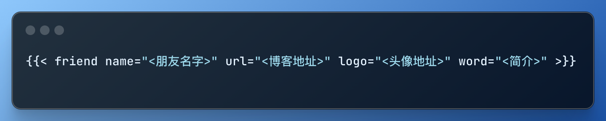
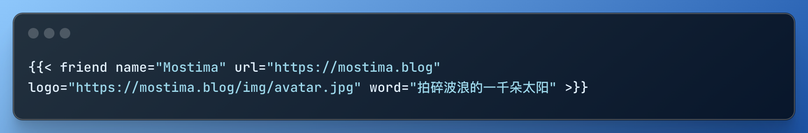

<!-- # Hugo添加友链 -->
本文记录为本站添加友链的方法，虽然目前为止博客还没有什么有价值的内容，也没有什么友链可挂，但还是想一次性把它装修完整(瞎折腾). 另一方面也是由于在网上没有看到有关于使用 Blowfish 主题的教程，所以把过程记录下来希望能帮到有需要的朋友们～

在查阅 Blowfish 文档后得知，为 Blowfish 主题添加友链分为以下三步：

- 创建 shortcode 模板
- 创建 css 样式
- 使用友链

<!-- 主题： Blowfish -->

## 创建 shortcode 模板

在 `<博客根目录>/layouts/shortcodes` 下创建文件 `friend.html`, 将以下内容写入并保存

```html
{{ if .IsNamedParams }}
<a target="_blank" href={{ .Get "url" }} title={{ .Get "name" }} class="friendurl">
  <div class="frienddiv"> <div class="frienddivleft">
      
    </div>
    <div class="frienddivright">
      <div class="friendname">{{ .Get "name" }}</div>
      <div class="friendinfo">{{ .Get "word" }}</div>
    </div>
  </div>
</a>
{{ end }}
```

## 创建 CSS 样式

在 `<博客根目录>/assets/css` 目录下创建 `custom.css` ，我的配置如下，仅作参考，需自行根据你使用的主题调整：

```css
/* 根据主题修改颜色 */
:root {
    --friend-bg: rgb(196, 217, 246); /* 浅色模式背景颜色 */
    --friend-name-color: #000000;
    --friend-url-color: #000000;
    --friend-bg-edge: #ffffff /* 头像外的色圈颜色 */
}

.dark {
    --friend-bg: rgba(214, 181, 82, 0.9);/* 深色模式背景颜色 */
    --friend-name-color: #000000;
    --friend-url-color: #000000;
    --friend-bg-edge: #ffffff;
}

.friendurl {
    text-decoration: none !important;
    color: var(--friend-url-color);
    box-shadow: none !important;
}

/* 鼠标触碰放大时链接颜色 */
.friendurl:hover{
    color: #000000;
}

/* 深色模式下 */
.dark .friendurl:hover {
    color: #000000;
}

.myfriend {
    width: 56px !important;
    height: 56px !important;
    border-radius: 50%!important;
    padding: 2px;
    margin-top: 20px !important;
    margin-left: 14px !important;
    background-color: var(--friend-bg-edge); /* 头像外的色圈颜色 */
}

.frienddiv {
    overflow: auto;
    height: 100px;

    /* 控制卡片长短 */
    /* width: 100%; */
    width: 292px;
    display: inline-block !important;

    /* 修改 margin 以调整两个友链间的间距 */
    margin-right: 15px;
    margin-bottom: 10px;

    /* 背景矩形圆角半径 */
    border-radius: 25px;
    background: var(--friend-bg);
    /* 背景磨砂玻璃 */
    backdrop-filter: blur(15px);

    -webkit-transition: all ease-out 0.3s;
    -moz-transition: all ease-out 0.3s;
    -o-transition: all ease-out 0.3s;
    transition: all ease-out 0.3s;
}

.dark .frienddiv {
    overflow: auto;
    height: 100px;
    width: 292px;
    display: inline-block !important;

    margin-right: 15px;
    margin-bottom: 10px;
    border-radius: 25px;

    background: var(--friend-bg);
    /* background: rgba(var(--friend-bg-r), var(--friend-bg-g), var(--friend-bg-b), 1); */
    backdrop-filter: blur(15px);

    -webkit-transition: all ease-out 0.3s;
    -moz-transition: all ease-out 0.3s;
    -o-transition: all ease-out 0.3s;
    transition: all ease-out 0.3s;
}

.frienddiv:hover {
    /*浅色模式下鼠标碰到友链时放大的背景颜色 */
    background: var(--friend-bg); 
    transition: transform 0.9s;
    -webkit-transform: scale(1.03);
    -moz-transform: scale(1.03);
    -ms-transform: scale(1.03);
    -o-transform: scale(1.03);
    transform: scale(1.03);
}

.dark .frienddiv:hover {
    /* 深色模式下鼠标碰到友链时放大的背景颜色 */
    background: var(--friend-bg);
}

.frienddiv:hover .frienddivleft img { 
    transition: 0.9s !important;
    -webkit-transition: 0.9s !important;
    -moz-transition: 0.9s !important;
    -o-transition: 0.9s !important;
    -ms-transition: 0.9s !important;
    transform: rotate(360deg) !important;
    -webkit-transform: rotate(360deg) !important;
    -moz-transform: rotate(360deg) !important;
    -o-transform: rotate(360deg) !important;
    -ms-transform: rotate(360deg) !important;
}

.frienddivleft {
    width: 92px;
    float: left;
    margin-right: -5px;
}

.frienddivright {
    margin-top: 18px;
    margin-right: 18px;
}

.friendname {
    text-overflow: ellipsis;
    font-size: 100%;
    margin-bottom: 5px;
    /* color: var(--primary); */
    color: var(--friend-name-color);
}

.friendinfo {
    text-overflow: ellipsis;
    font-size: 70%;
    color: var(--primary);
}

@media screen and (max-width: 600px) {
    .friendinfo {
        display: none;
    }
    .frienddivleft {
        width: 84px;
        margin: auto;
    }
    .frienddivright {
        height: 100%;
        margin: auto;
        display: flex;
        align-items: center;
        justify-content: center;
    }
    .friendname {
        font-size: 18px;
    }
}
```

## 使用友链

最后在友链页面中使用以下方式引入友链：
<!--  -->

```lua

```

例如：
<!--  -->
```lua

```

效果如下：


<!--  -->
