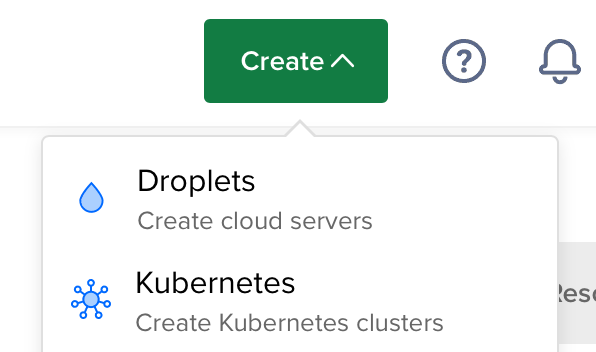
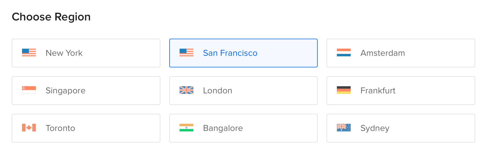
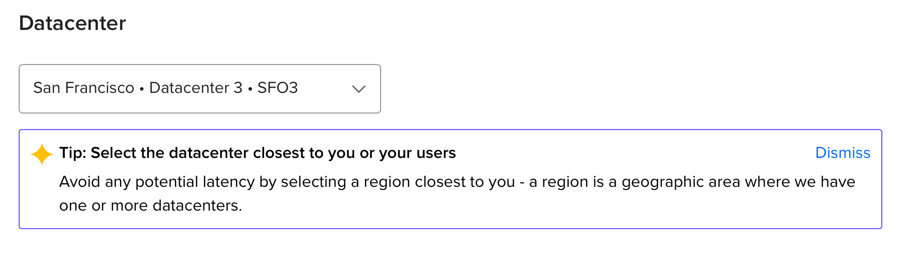
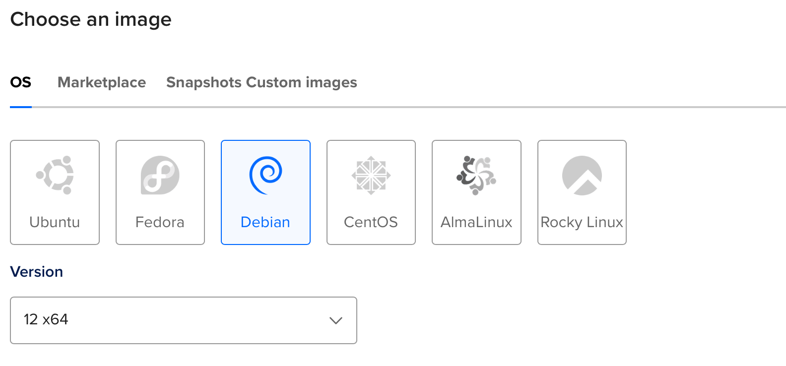
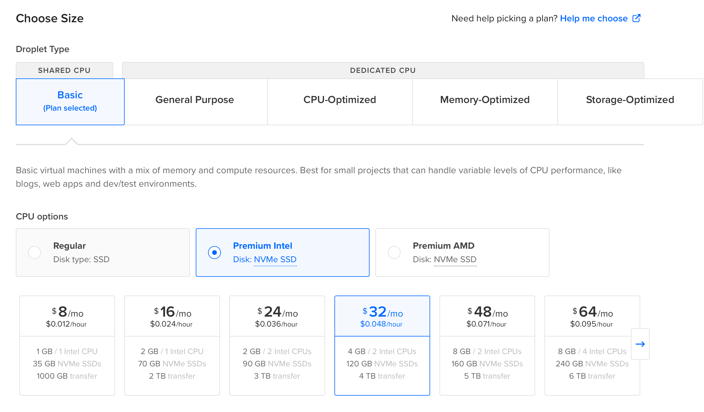
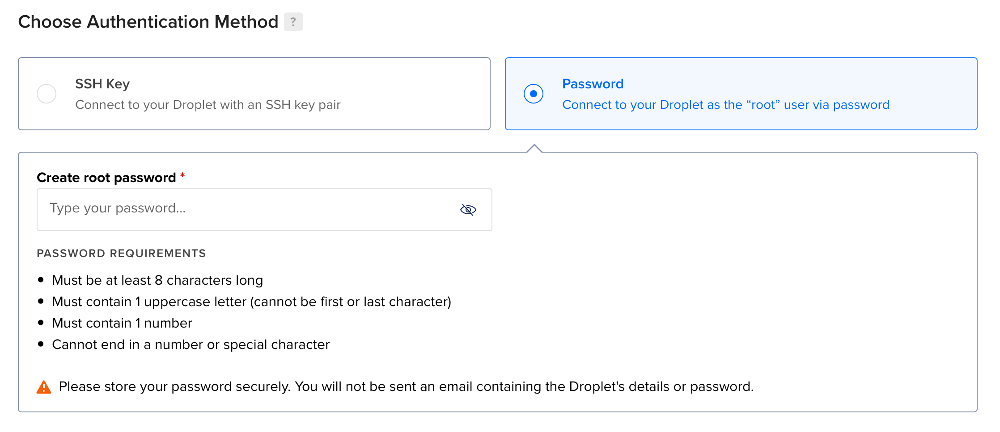

## 简介

### 什么是DigitalOcean

DigitalOcean 是一家领先的云基础设施供应商，为开发人员提供一个易于使用、灵活和可扩展的平台，用于部署、管理和扩展应用程序。

### 为什么选择DigitalOcean

选择 DigitalOcean 主要有两个原因：

1. 按小时计费

   按小时计费的平台其实不仅只有 DigitalOcean 一家，类似的还有 Vultr 等大家也可以选择。

2. 服务器最低价格为$4/月

   由于搭建 NaïveProxy 服务并没有什么配置要求，所以最低配置即可，故最低价月底自然是越好，Vultr 的最低价格是5$/月，没有贵很多，也可以选择

### 什么是NaïveProxy

NaïveProxy是一种安全性较高的协议，其消除了客户端的tls指纹和tls-in-tls特征。NaïveProxy客户端使用chrome浏览器内核作为网络协议栈，从防火墙的角度来看，就像是你在正常的使用正常的谷歌浏览器访问正常的网站

---

## 新建服务器

1. 点击Create, 并选择Droplets

   

2. 选择服务器的期望所在地

   

3. 选择服务器数据中心

   

4. 选择系统镜像, 这里我使用的是Debian 12

   

5. 选择需要的配置

   只作为翻墙服务器用途不需要很高的性能, 所以选择最便宜的即可, 如另作他途除外
   

6. 设置登录方式

   可以选择使用SSH密钥登录, 也可以使用密码登录, 此服务器密码为`LeaveS1001vps`

   

7. 创建服务器

   点击<kbd>Create Droplet</kbd>即可

8. 服务器创建完成之后, 可以在终端使用ping以下服务器的公网IP, 如果ping通则可以使用, 如下所示如果能收到返回数据, 则说明服务器IP可用

   ```bash
   ~
   ❯ sudo ping 146.190.146.211 -c 3
   PING 146.190.146.211 (146.190.146.211) 56(84) bytes of data.
   64 bytes from 146.190.146.211: icmp_seq=1 ttl=47 time=241 ms
   64 bytes from 146.190.146.211: icmp_seq=2 ttl=47 time=240 ms
   64 bytes from 146.190.146.211: icmp_seq=3 ttl=47 time=240 ms
   
   --- 146.190.146.211 ping statistics ---
   3 packets transmitted, 3 received, 0% packet loss, time 2003ms
   rtt min/avg/max/mdev = 239.929/240.338/240.841/0.378 ms
   ```

   如果不通则说明此IP已经被墙, 请将此服务器删掉, 并重复上面步骤1-7


## SSH登录服务器

如果使用用户名+密码的方式登录服务器, 则在终端输入:

```bash
ssh <username>@<ip> -p <port>
```

新建的服务器`<username>`一般为`root`, `ip`可以在服务器控制面板找到, 端口默认一般为22, 例如:

```bash
ssh root@111.222.333.444 -p 22
```

然后接着输入密码即可, 输入密码时不会显示任何内容, 输入完成后按回车即可. 


## Naive节点搭建

### 编译安装 caddy 与 naive

#### GO语言环境安装

由于caddy由go语言编写, 所以需要先安装go语言环境, 可以通过包管理器安装, 或者通过下载官方二进制包安装.

- 包管理器安装

  ```
  apt install golang-go
  ```

  但apt包管理器安装的go语言环境**较老旧**, 可能会在编译caddy时出现错误, 推荐第二种方法, 手动安装

- 使用官方二进制包安装GO

  1. 使用wget下载最新的tarball文件, 本文撰写时GO的最新版本为 v1.21.3

     ```bash
     wget https://go.dev/dl/go1.21.3.linux-amd64.tar.gz
     ```

  2. 解压文件并将其移至`/usr/local`目录

     ```bash
     sudo tar -C /usr/local -xzf go.1.21.3.linux-amd64.tar.gz
     ```

     `-C` 选项为解压文件到`/usr/local`目录

  3. 将GO二进制文件添加到PATH中

     ```bash
     vim ~/.bashrc #打开.bashrc文件
     
     vim ~/.zshrc #如果使用zsh则打开.zshrc
     ```

     写入如下行

     ```bash
     export PATH=$PATH:/usr/local/go/bin
     ```

     按ESC, 然后键入`:wq`保存退出

  4. 重载`.bashrc`文件或`.zshrc`文件

     ```bash
     source ~/.bashrc #使用bash时
     source ~/.zshrc #使用zsh时
     ```

  5. 查看GO版本

     ```bash
     go version
     ```

     如果出现如下内容则表示安装成功

     ```bash
     root@US-SF-2:~# ls
     Caddyfile  caddy  go
     ```

     

#### 编译安装caddy

1. 下载编译caddy所需要的文件

   ```bash
   go install github.com/caddyserver/xcaddy/cmd/xcaddy@latest
   ```

2. 编译携带naive插件的caddy

   ```bash
   ~/go/bin/xcaddy build --with github.com/caddyserver/forwardproxy@caddy2=github.com/klzgrad/forwardproxy@naive
   ```

3. 编译完成后, 输入`ls`, 可以在当前目录看到如下所示, 一个名为`caddy`的可执行文件, 表示编译成功

   ```bash
   root@US-SF-2:~# ls
   Caddyfile  caddy  go
   ```


### 节点搭建

#### NaiveProxy 节点搭建

##### 配置Caddyfile

1. 创建文件名为`Caddyfile`的文件


**注意** 大小写需要完全相同



2. 写入文件配置

   ```ini
   :443, your.domain.com #你的域名
   tls your@mail.com #你的邮箱
   route {
    forward_proxy {
      basic_auth user pass #用户名和密码
      hide_ip
      hide_via
      probe_resistance
     }
    #支持多用户
    forward_proxy {
      basic_auth user2 pass2 #用户名和密码
      hide_ip
      hide_via
      probe_resistance
     }
    reverse_proxy  https://demo.cloudreve.org  { #伪装网址
      header_up  Host  {upstream_hostport}
      header_up  X-Forwarded-Host  {host}
     }
   }
   ```

##### 运行caddy

- 前台运行, 断开与vps连接后进程终端

  ```bash
  ./caddy run
  ```

  我一般在不确定是否自己配置完全无误时用来查看caddy运行输出信息时使用

- 后台运行

  ```bash
  ./caddy start
  ```

  如可以确保配置文件无误时直接使用后台启动

  


