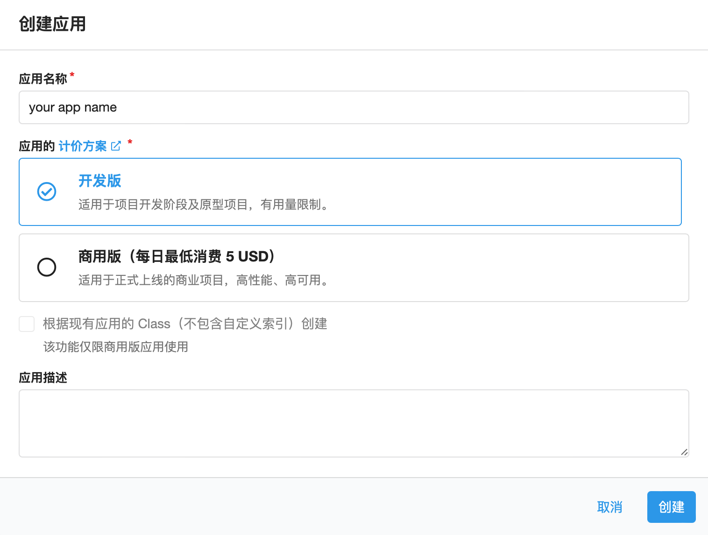
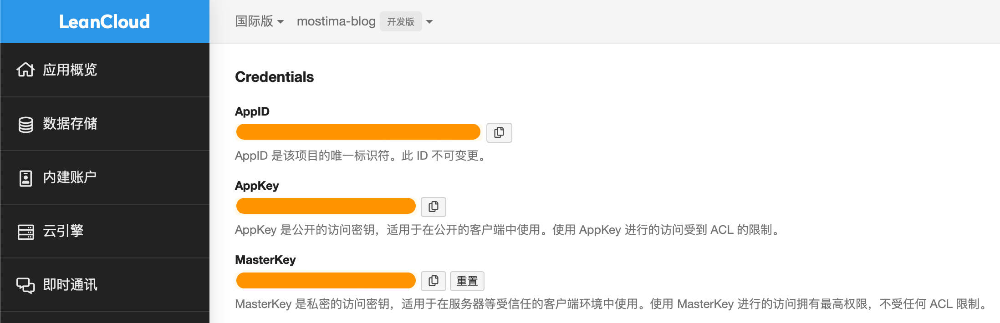
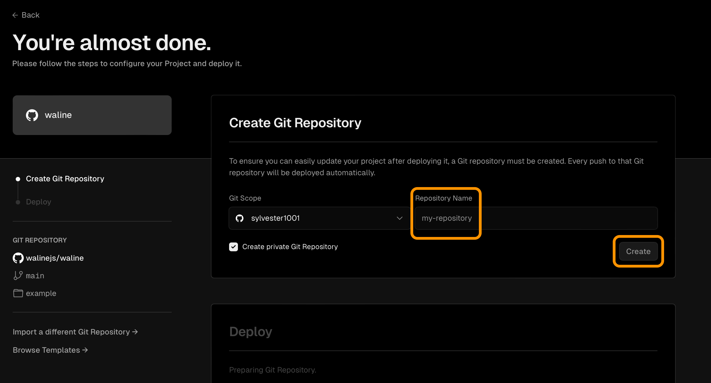
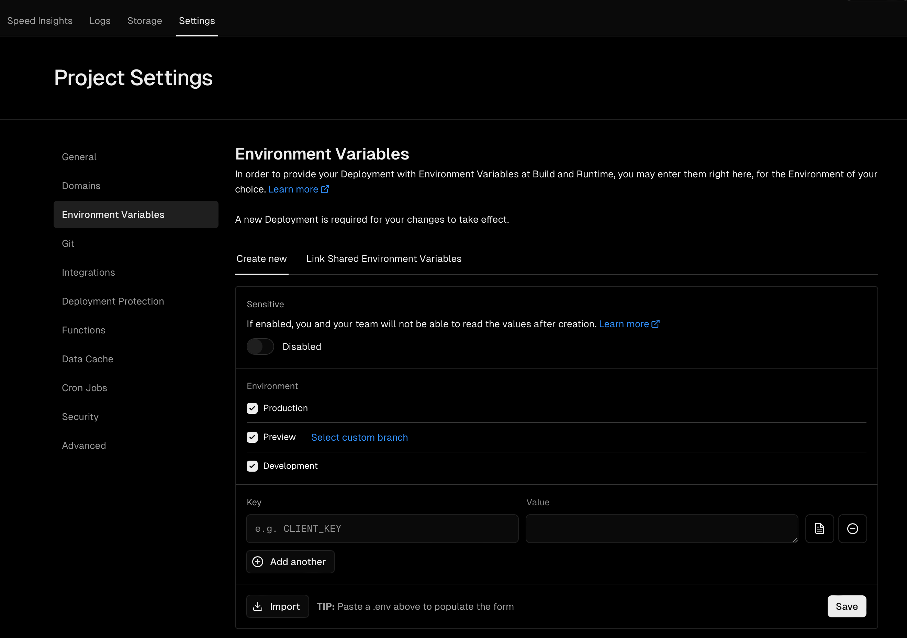
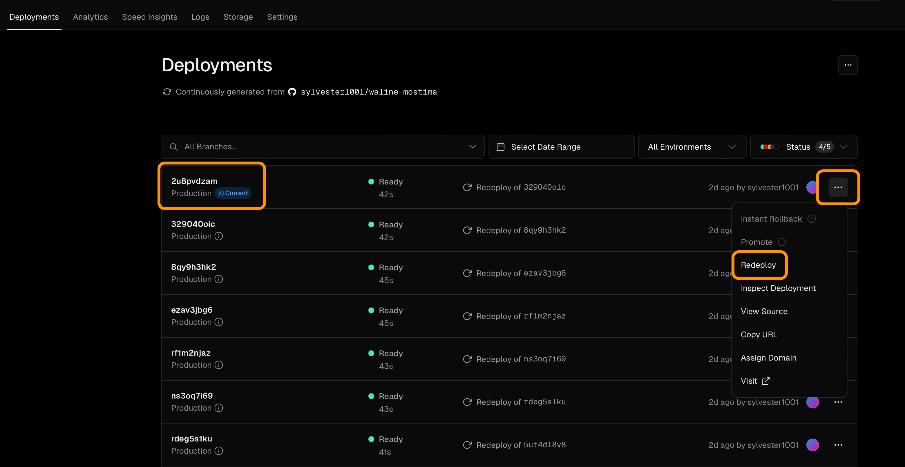
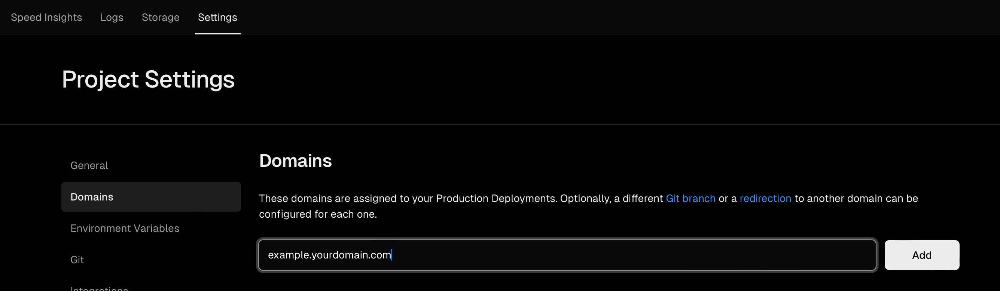

<!-- 头部使用showHero 参数来实现是否显示hero -->
<!-- 然后添加 heroStyle 来实现背景或文章头feature图片的显示 -->
<!-- 参数有 basic(只显示头部featured图片)，big(显示大featured图)，background(显示背景图片), thumbAndBackground(同时显示featured头图和背景图片) -->

Waline 是一款简洁，安全的评论系统。它支持完整的 Markdown 语法，同时包含表情，数学公式， HTML嵌入等。

在允许匿名评论的基础上支持账号登录，可以有效保持身份。并且允许使用 Vercel 免费，且简洁方便的部署。

## 配置方式

### LeanCLoud 设置（数据库）

1. &nbsp;登录&nbsp;或&nbsp;注册&nbsp;

2. 点击左上角 [创建应用](https://console.leancloud.app/apps) 并起一个名字 (选择免费的**开发版**）

   

3. 进入刚刚创建的应用，点击左下角的 `设置`，然后选择 `应用凭证`，此时你会看到你的 `AppID`, `AppKey` 以及 `MasterKey`. 请妥善记录他们，后续将会使用。

   



**注意**： 如果你正在使用 Leancloud 国内版 ([leancloud.cn](https://leancloud.cn/))，推荐你切换到国际版 ([leancloud.app](https://leancloud.app/))。否则，你需要为应用绑定**已备案**的域名




### Vercel 部署服务端

[](https://vercel.com/new/clone?repository-url=https%3A%2F%2Fgithub.com%2Fwalinejs%2Fwaline%2Ftree%2Fmain%2Fexample)


1. 点击上方 <kbd>Deploy</kbd> 按钮跳转至 Vercel 部署服务端

2. 输入一个项目名称，然后点击 <kbd>Create</kbd> 进行创建

   

3. Vercel 会基于 Waline 的模板创建仓库

4. 等待片刻，会显示`Congratulations!` 提示你部署成功，然后请点击 `Go to Dashboard` 前往控制台

5. 在顶部点击 ` Settings` , 然后在左下方点击`Environment Variables` 进入环境变量配置页面

6. 配置三个环境变量，分别是：

   1. `LEAN_ID`

   2. `LEAN_KEY`

   3. `LEAN_MASTER_KEY` 

      这三个环境变量的值(Value) 分别对应上一步在 LeanCloud 中获取的 `AppID`, `AppKey` 以及 `MasterKey`

      

7. 配置完成所有的环境变量之后，点击顶部的 `Deployments` , 选择最近一次部署的右侧的 `···` , 然后点击 `Redeploy`，以重新部署让环境变量生效

   

8. 此时会跳转至 Overview界面, 并开始部署, 稍等片刻 STATUS 会变成 `Ready` 
9. 可以点击右侧 <kbd>Visit</kbd> 前往部署好的网址, 且此地址为你的 Waline 服务端地址

### 设置自定义域名

1. 点击顶部 `Settings`, 后于左侧点击 `Domains`

2. 输入需要设置的自定义域名后，点击 <kbd>Add</kbd>

   

3. 在你的域名服务器商，或 Cloudflare（如果你使用 Cloudflare 管理你的域名）处添加一条 `CNAME` 记录

   | Type  | Name                                | Value                |
   | ----- | ----------------------------------- | -------------------- |
   | CNAME | example(你在上一步中填写的二级域名) | cname.vercel-dns.com |

4. 等待生效后即可用自定义的域名来访问了 🎉 🎊

### HTML 引入

由于我使用 Blowfish 主题, 故以此主题为例

1. 在博客文件夹下的 `/layouts/partials/comments.html` 中粘贴以下内容

    **注意**：CSS 变量可自定义， 默认样式为 [变量与默认值](https://waline.js.org/reference/client/style.html) 

   ```html
   <head>
       <!-- ... -->
       <link
         rel="stylesheet"
         href="https://unpkg.com/@waline/client@v2/dist/waline.css"
       />
       <!-- ... -->
     </head>
     <body>
       <!-- ... -->
   
       <!-- <div id="waline-recent"></div> -->
       <!-- <script type="module"> -->
       <!--     import { RecentComments } from 'https://cdn.jsdelivr.net/npm/@waline/client/dist/waline.mjs'; -->
       <!---->
       <!--     RecentComments({ -->
       <!--         el: '#waline-recent', -->
       <!--         serverURL: 'http://waline.vercel.app', -->
       <!--         count: 1, -->
       <!--     }); -->
       <!-- </script> -->
   
       <!-- <div id="article-info"> -->
         <!-- ... -->
         <!-- 阅读量: <span class="waline-pageview-count" data-path="{{.RelPermalink}}" /> -->
         <!-- ... -->
       <!-- </div> -->
   
       <div id="waline"></div>
       <script type="module">
         import { init } from 'https://unpkg.com/@waline/client@v2/dist/waline.mjs';
   
         init({
           el: '#waline',
           serverURL: 'https://waline.mostima.blog',
           lang: 'zh-CN',
           emoji: [
           '//unpkg.com/@waline/emojis@1.2.0/bmoji',
           '//unpkg.com/@waline/emojis@1.2.0/tieba',
           '//unpkg.com/@waline/emojis@1.2.0/qq',
           '//unpkg.com/@waline/emojis@1.2.0/alus',
           '//unpkg.com/@waline/emojis@1.1.0/bilibili',
           'https://cdn.jsdelivr.net/gh/norevi/waline-blobcatemojis@1.0/blobs',
           ],
           dark: 'html[class="scroll-smooth dark"]',
   
         });
       </script>
   
   
       <style>
         /*日间模式*/
         :root {
           /* 字体大小 */
           --waline-font-size: 16px;
   
           /* 白色 */
           --waline-white: #ffff;
           /* 浅灰色 */
           --waline-light-grey: #999;
           /* 深灰色 */
           --waline-dark-grey: #666;
   
           /* 主题色 */
           --waline-theme-color: #3b82f6;
           /* 活动状态的颜色 */
           --waline-active-color: #2ecc71;
   
           /* 一般文本颜色 */
           --waline-color: #222;
           /* 背景颜色 */
           --waline-bgcolor: #fff;
           /* 较浅的背景颜色 */
           --waline-bgcolor-light: #f8f8f8;
           /* 鼠标悬停时的背景颜色 */
           --waline-bgcolor-hover: #2ecc71;
           /* 边框颜色 */
           --waline-border-color: #ddd;
           /* 禁用状态的背景颜色 */
           --waline-disable-bgcolor: rgba(248, 248, 248, 0.4);
           /* 禁用状态的文本颜色 */
           --waline-disable-color:#bbb;
           /* 代码块的背景颜色 */
           --waline-code-bgcolor: #282c34;
   
           /* 引用块的颜色 */
           --waline-bq-color: #f0f0f0;
   
           /* 头像 */
           --waline-avatar-size: 3.25rem;
           /* 移动设备上的头像大小 */
           --waline-m-avatar-size: calc(var(--waline-avatar-size) * 9 / 13);
   
           /* 徽章颜色 */
           --waline-badge-color: #3b82f6;
           /* ：徽章字体大小 */
           --waline-badge-font-size: 12px;
   
           /* 信息块的边框 */
           --waline-info-border: 1px solid #999;
           /* 信息块的文本颜色 */
           --waline-info-color: #999;
           /* 信息块的字体大小 */
           --waline-info-font-size: 16px;
             /* 信息块背景颜色 */
           --waline-info-bgcolor: rgba(235, 235, 235, 0.4);
   
           /* 渲染选择，一般边框样式 */
           --waline-border: 1px solid var(--waline-border-color);
           /* 头像的圆角半径 */
           --waline-avatar-radius: 50%;
           /* 阴影效果 */
           --waline-box-shadow: none;
         }
   
         /* 暗黑模式，根据用户设置 ↓ */
         html[class="scroll-smooth dark"]{
           /* 这是用于表示白色的CSS变量, 在暗模式下，白色将变为黑色*/
           --waline-white: #000;
            /* 浅灰色的CSS变量, 在暗模式下，变为深灰色 */
           --waline-light-grey: #999;
           /* --waline-light-grey: #666;*/
            /* 示深灰色, 在暗模式下，变为浅灰色 */
           --waline-dark-grey: #999;
   
           /* 一般文本颜色 */
           --waline-color: #c2c2c2;
            /* 背景颜色 */
           --waline-bgcolor: #1E293B;
            /* 较浅的背景颜色 */
           --waline-bgcolor-light: #2A354F;
            /* 边框颜色 */
           --waline-border-color: #666;
            /* 禁用状态的背景颜色 */
           --waline-disable-bgcolor: rgba(68, 68, 68, 0.8);
            /* 禁用状态的文本颜色 */
           --waline-disable-color: #888;
   
           /* 引用块颜色 */
           --waline-bq-color: #1F2D4B;
   
           /* 信息块背景颜色 */
           --waline-info-bgcolor: rgba(31, 45, 75, 0.8);
            /* 信息块字体 */
           --waline-info-color: #888;
           /* 信息块的边框 */
           --waline-info-border: 1px solid #d3d3d3;
         }
   
       </style>
   
   
     </body>
   ```

### 评论管理后台

评论管理后台地址为 `<serverURL>/ui/register` , 首个注册的用户会被设为管理员账户, 之后注册的用户则为普通用户

### 开启评论

在博客目录中的 `/config/_default/params.toml` 文件下, 将 `showComments` 修改为 `true`

```toml
[article]
	showComments = true
```

### Telegram 评论通知

Telegram 通知通过 Telegram bot 机器人实现，需要配置以下几个环境变量:

- `TG_BOT_TOKEN`: Telegram 机器人用于访问 HTTP API 的 token，通过 [@BotFather](https://t.me/BotFather) 创建机器人获取，必填。
- `TG_CHAT_ID`: 接收消息对象的 `chat_id`，可以是单一用户、频道、群组，通过 [@userinfobot](https://t.me/userinfobot) 获取，必填。
- `AUTHOR_EMAIL`: 博主邮箱，用来区分发布的评论是否是博主本身发布的。如果是博主发布的则不进行提醒通知。
- `SITE_NAME`: 网站名称，用于在消息中显示。
- `SITE_URL`: 网站地址，用于在消息中显示。
- `TG_TEMPLATE`: Telegram 使用的通知模板，变量与具体格式可参见下文的通知模板。未配置则使用默认模板。

#### Telegram 通知模板

~~~markdown
💬 <your site> 有一条新评论

{{self.nick}} 回复:

```
{{self.comment-}}
```

{{-self.commentLink}}

_邮箱_: `{{self.mail}}`

_地址_: [来源文章]({{site.postUrl}})
~~~

