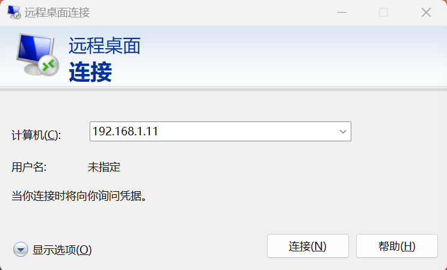
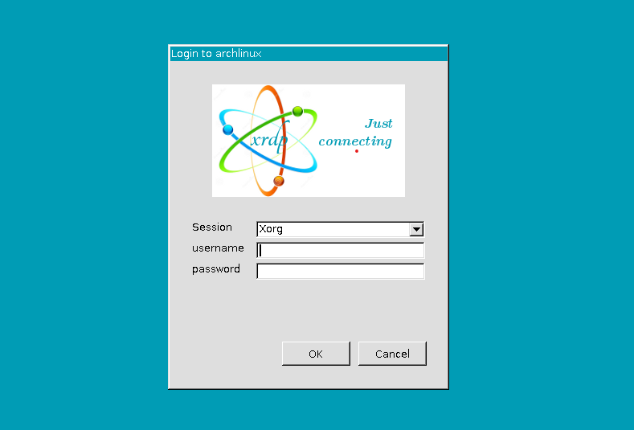
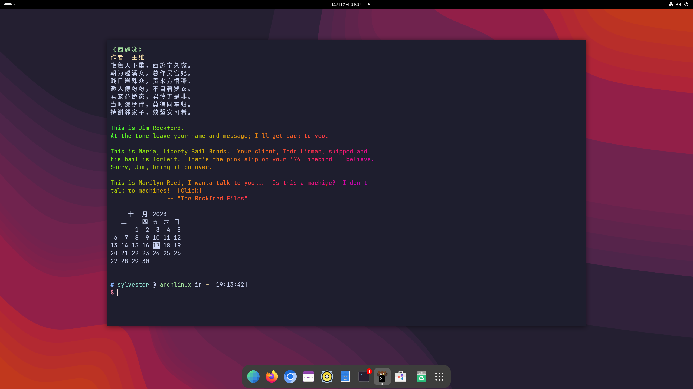

## 前言

由于做 CAD 的缘故, 公司使用 Cadence Virtuoso 等 EDA 软件仅支持在 Linux 环境中运行, 再加之平时喜欢折腾, 在 Windows 或者 macOS 中使用虚拟机总没有一台宿主机来的舒坦 (其实就是想买电脑了). 又考虑到可以用来做旁路由, 让家里的电视, switch 等所有设备方便的科学上网, 所以购入了一台小型 server 放在家里, 平时待机3-5W左右的功耗也足以让我心安理得的让它7/24 online.

有桌面洁癖的我实在是不希望桌面的两个显示器后面再多出现两根线, 所以决定用 Headless 的方式使用这台 server, 由于 EDA 软件使用需要有图形界面, 所以决定使用 XRDP, 虽然 VNC 也可以, 但由于 XRDP 支持 BIOS 屏幕显示, 所以我决定使用它.

我的环境：Arch Linux + GNOME 45

## 概述

### 什么是 RDP

相信 Windows 的用户都对 RDP(Remote Desktop Protocol, 远程桌面) 不陌生, 它是由微软开发的一种专有协议,  为用户提供了通过网络连接到另一台计算机的图形界面。在使用上, 用户需要使用 RDP 客户端软件, 而在远程另一台计算机则需要运行 RDP 服务器软件。

- Windows 内置 RDP 服务器
- Linux 与 macOS 可以安装 RDP 服务器

服务器默认监听 TCP 端口 3389 和 UDP 端口3389

### 什么是 XRDP

XRDP 是一个开源的远程桌面协议服务器，它用来实现 Linux 接受来自 Windows、Mac 或者 Linux 远程桌面客户端或的连接。这意味着你不需要在所使用的 Windows 或 macOS 机器上安装额外的第三方应用程序。


---


## 安装方式

1. 安装 xrdp 核心包

   ```bash
   yay -S xrdp
   ```

2. 安装 Xorg 后端（根据自己的设备在以下之中三选一即可）：

   - Inter 与 AMD 核显 (支持硬件加速)

     ```bash
     yay -S xortxrdp-glamor
     ```

   - 不使用 GPU (CPU占用率会高)

     ```bash
     yay -S xorgxrdp
     ```

   - NVidia 独显

     ```bash
     yay -S xordxrdp-nvidia
     ```

3. 安装 Xorg-xinit

   ```bash
   pacman -S xorg-xinit
   ```

4. 修改 `Xwrapper.config` 文件

   在`/etc/X11/Xwrapper.config`中加入以下内容：

   ```bash
   allowed_users=anybody
   needs_root_rights=no
   ```

   > 如果没有这个文件则手动创建

5. 在`~/.xinitrc`中写入以下内容：

   ```bash
   #!/bin/sh
   unset SESSION_MANAGER
   unset DBUS_SESSION_BUS_ADDRESS
   export XDG_SESSION_TYPE=x11
   export GDK_BACKEND=x11
   exec dbus-launch gnome-session
   ```

   > 同样，如果没有此文件则手动创建

6. 赋予`~/.xinitrc`执行权限

   ```bash
   chmod +x ~/.xinitrc
   ```

7. 启用服务

   ```bash
   sudo systemctl enable xrdp.service
   sudo systemctl enable xrdp-sesman.service
   ```

8. 重启

   ```bash
   sudo reboot
   ```


---


## 使用远程桌面连接Arch Linux

1. 打开「远程桌面连接」

2. 输入需要Linux的ip

   

3. 在弹出的窗口中输入**用户名**以及**密码**

   

4. 不出意外应该可以看到桌面了

